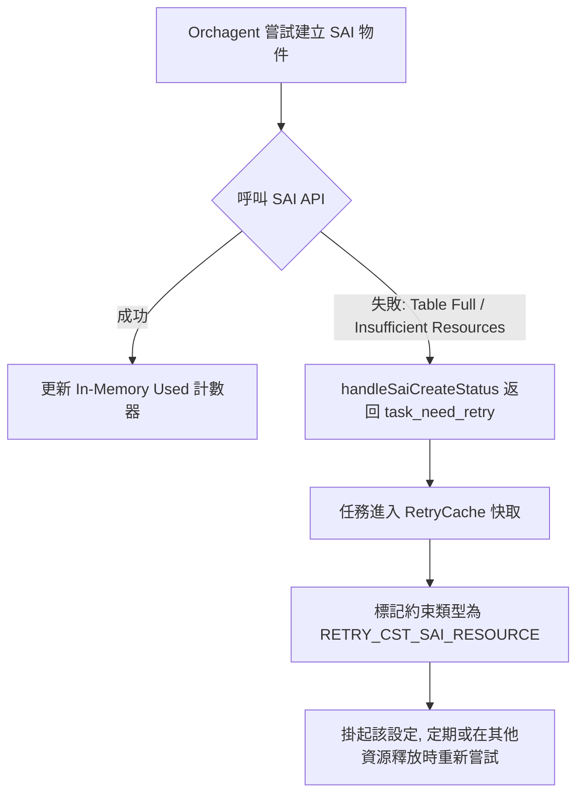
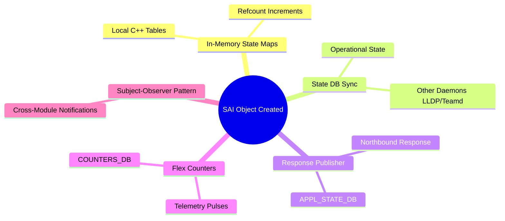

# SONiC SWSS Orchagent: CRM & Bookkeeping 運作機制與設計模式

本文件詳細記錄了 SONiC SWSS `orchagent` 中，關於 **CrmOrch (Critical Resource Monitoring)** 的架構設計、資源使用率同步模式、ASIC 資源不足（Table Full）時的容錯與重試機制，以及 SAI 物件建立成功後的核心記帳（Bookkeeping）行為。

---

## 1. CrmOrch 架構與運作模式

### 1.1 程序架構 (Process Architecture)
* **非獨立 Process**：`CrmOrch` 並非以獨立程序（Process）運行，而是作為一個類別物件被實體化並執行在 **`orchagent`** 守護行程（Daemon）之中。
* **統一管理**：在 `orchagent` 的初始化階段（[orchdaemon.cpp](file:///home/ubuntu/sonic-buildimage/src/sonic-swss/orchagent/orchdaemon.cpp)），`CrmOrch` 與其他功能性 Orchestrator（如 `PortsOrch`、`RouteOrch`、`NeighOrch` 等）一起被建立，並共享同一個 Main Loop 事件循環與 Redis 連線。

### 1.2 counters_db 同步機制 (Periodic Polling vs Real-time)
當其他 Orchestrator 成功新增或刪除 SAI 物件時，並**不會立即寫入** `COUNTERS_DB`。其實施流程如下：
1. **內存計數（In-Memory Bookkeeping）**：
   * 當物件新增成功，調用 `gCrmOrch->incCrmResUsedCounter(...)`，僅在內存中將 `usedCounter` 遞增。
   * 當物件刪除成功，調用 `gCrmOrch->decCrmResUsedCounter(...)`，僅在內存中將 `usedCounter` 遞減。
2. **定時同步（Periodic Polling）**：
   * `CrmOrch` 內部註冊了一個 `SelectableTimer` 定時器，預設間隔為 5 分鐘（300 秒）。
   * 定時器觸發時，執行 `CrmOrch::doTask(SelectableTimer &timer)`：
     * **步驟 A**：呼叫 `getResAvailableCounters()`，向底層 SAI 查詢最新且真實的可用空間（`availableCounter`）。
     * **步驟 B**：呼叫 `updateCrmCountersTable()`，將最新的 `used` 和 `available` 計數批次同步到 Redis 的 `COUNTERS_DB`（表名為 `CRM`）。
     * **步驟 C**：呼叫 `checkCrmThresholds()`，若資源使用率高於警戒水位（預設 85%），則記錄警報日誌並對系統事件總線（Event Bus）發佈事件。

---

## 2. 為什麼需要向底層 SAI 查詢可用資源 (Available Space)？

雖然 `CrmOrch` 在內存中精確維護了已使用的資源計數（`usedCounter`），但它**無法**在內存中自行計算或推導出剩餘可用資源空間（`availableCounter = Total - Used`），原因在於 ASIC 硬體架構的複雜性：

1. **實體資源池動態共享 (Dynamic Resource Sharing)**：
   * 在大部分 ASIC 晶片中，許多底層資源（如 TCAM/SRAM）並非靜態硬切（Hard-partitioned）。例如，IPv4 路由與 IPv6 路由通常共享同一個 LPM（最長前綴匹配）記憶體池；一條 IPv6 路由佔用的物理空間可能是 IPv4 的 2 到 4 倍。因此，新增 IPv6 路由會動態擠壓 IPv4 的最大可用容量。
2. **硬體碎片與排列限制 (ASIC Fragmentation)**：
   * 某些硬體資源（如 ACL 規則）的寫入受到優先權（Priority）與連續物理空間的限制。即便物理上還有空閒欄位，也可能因不連續或衝突而無法塞入新規則。
3. **平台抽象化**：
   * 為了避免在軟體層（Orchagent）為每家晶片廠商（Broadcom, Nvidia/Mellanox, Barefoot 等）重複實作專有的內存分配演算法，SONiC 將此複雜度下沉至 SAI 驅動層。藉由標準 API（如 `sai_object_type_get_availability`），由晶片廠商的 SDK 提供最精確的真實剩餘容量。

---

## 3. ASIC 資源不足（Table Full）時的容錯與重試機制

當寫入路由、ACL 或鄰近表遇到 Table Full 或記憶體不足時，`orchagent` 透過 **Retry Cache** 機制進行優雅降級與重試：

### 3.1 流程圖示 (Workflow)


### 3.2 關鍵程式碼分析
* **狀態轉譯**：在 [saihelper.cpp:L636-676](file:///home/ubuntu/sonic-buildimage/src/sonic-swss/orchagent/saihelper.cpp#L636-L676) 的 `handleSaiCreateStatus` 中，當返回狀態為資源不足時，將返回 `task_need_retry`：
  ```cpp
  case SAI_STATUS_INSUFFICIENT_RESOURCES:
  case SAI_STATUS_TABLE_FULL:
  case SAI_STATUS_NO_MEMORY:
  case SAI_STATUS_NV_STORAGE_FULL:
      return task_need_retry;
  ```
* **快取佇列**：底層的 `RetryCache`（定義於 [retrycache.h](file:///home/ubuntu/sonic-buildimage/src/sonic-swss/orchagent/retrycache.h)）會將此工作儲存，並綁定限制條件 `ConstraintType::RETRY_CST_SAI_RESOURCE`。

---

## 4. SAI 物件建立成功後的核心記帳（Bookkeeping）行為

當一個 SAI 物件被成功建立後，除了 CRM 之外，`orchagent` 還會同步執行以下五大系統記帳行為：



### 4.1 記憶體資料結構更新 (In-Memory State Tracking & Refcounts)
* **映射紀錄**：將 Logical Key（如 `IP Prefix`, `VLAN ID`）與實體產生的 `SAI OID` 記錄在內部 map 中，以供後續查詢或異動。
* **相依性計數**：如果該物件依賴於其他物件，會將被依賴物件的參照計數（`ref_count`）遞增，防止其被垃圾回收。
* *範例*：`RouteOrch` 內的 `m_syncdRoutes`；`FdbOrch` 內的 `m_entries`。

### 4.2 同步至狀態資料庫 (STATE_DB Sync)
* **系統透明度**：為了讓其他外部的協定 Daemon（例如 `teamd`、`lldpd`）或 CLI 指令能查詢實體運作狀態，Orchestrator 會將資料寫入 Redis 的 `STATE_DB`（DB 6）。
* *範例*：`FdbOrch` 成功建立 MAC Entry 後，會同步寫入 `STATE_DB` 內的 `FDB_TABLE`。

### 4.3 回報執行結果 (Response Publishing)
* **響應機制**：透過 `ResponsePublisher` 將執行成功（`SAI_STATUS_SUCCESS`）或失敗之響應寫入 `APPL_STATE_DB`，通知發起設定的北向或本機協定 Stack（如 `fpmsyncd`、P4RT）。
* *範例*：`RouteOrch::publishRouteState(...)` 將結果發佈至 `APP_ROUTE_TABLE_NAME` 的 Response Channel。

### 4.4 註冊至彈性計數器 (Flex Counter Registration)
* **效能監控**：若建立的物件包含硬體計數器（如 Ports、Queues、ACL Rule、DASH ENI 等），Orchestrator 會將其 OID 註冊至 `FlexCounterOrch`。
* *機制*：註冊後，背景的計數同步執行緒 `countersyncd` 就會開始定期透過 SAI 讀取該物件的流量統計，並寫入 `COUNTERS_DB` 供遠端 Telemetry/SNMP 獲取。

### 4.5 觀察者通知機制 (Subject-Observer Notifications)
* **模組聯動**：多個 Orchestrator 之間可能存在依賴。當特定物件建立完畢後，會發布事件通知訂閱的觀察者（Observers）進行聯動更新。
* *範例*：`FdbOrch` 在 FDB 更新時通知 `notify(SUBJECT_TYPE_FDB_CHANGE, &update)`。
